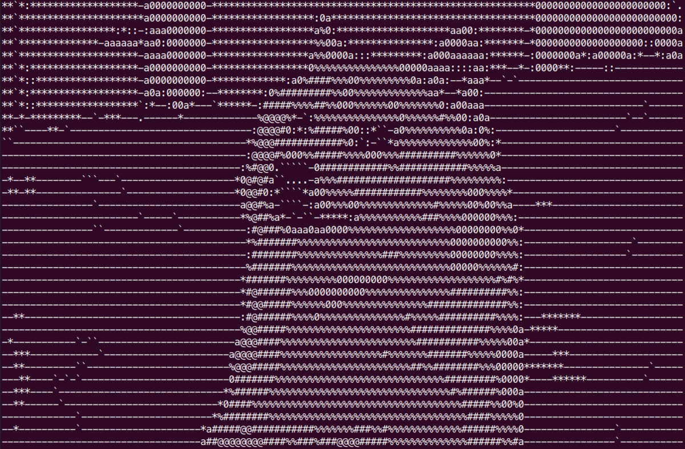

# ASCII Art Editor

[](https://opensource.org/licenses/MIT)


> **Final project for _Programming and Algorithmics 2_ (BI-PA2)**

## About
**ASCII Art Editor** is a CLI-based application designed to convert and manipulate images in the terminal. It supports standard image formats and offers a variety of post-processing effects. The engine is capable of generating static ASCII art as well as creating animated sequences.

### Key Features
* **Format Support:** Native support for `.bmp` and `.tga` files.
* **Image Manipulation:**
    * **Filters:** Brightness adjustment (Lightening/Darkening), Negative.
    * **Transformation:** Rotation (90°/180°/270°), Horizontal/Vertical flipping.
* **Animation:** Tools to create ASCII animations from image sequences.

<p align="center">
  
  <br>
  <em>Example output: An animated dog generated by the editor.</em>
</p>

---

## Getting Started

Follow these instructions to compile and run the project on your local machine.

### Prerequisites
* GCC/G++ Compiler
* Make

### Installation & Compilation
To compile the entire project, navigate to the root directory and run:

```bash
make compile
```

To compile the project and generate Doxygen documentation simultaneously:

```bash
make all
```

---

## Usage

Start the application using the following command:

```bash
make run

```

Once the program is running, the interactive CLI will guide you through:

1. Loading an image file.
2. Applying desired filters and transformations.
3. Saving the output or creating an animation.

---

## Makefile Options

The project includes a `Makefile` to automate common tasks. Below is a list of available commands:

| Command | Description |
| --- | --- |
| `make compile` | Compiles the source code and generates the executable. |
| `make run` | Runs the compiled executable. |
| `make doc` | Generates documentation using **Doxygen**. |
| `make all` | Compiles the project and generates documentation. |
| `make clean` | Removes compiled binaries, object files, and documentation. |
| `make test_all` | Executes the test suite to ensure functionality. |
| `make count` | Counts the lines of code in the project. |

---

## License

This project is licensed under the MIT License - see the [LICENSE](https://opensource.org/licenses/MIT) file for details.
